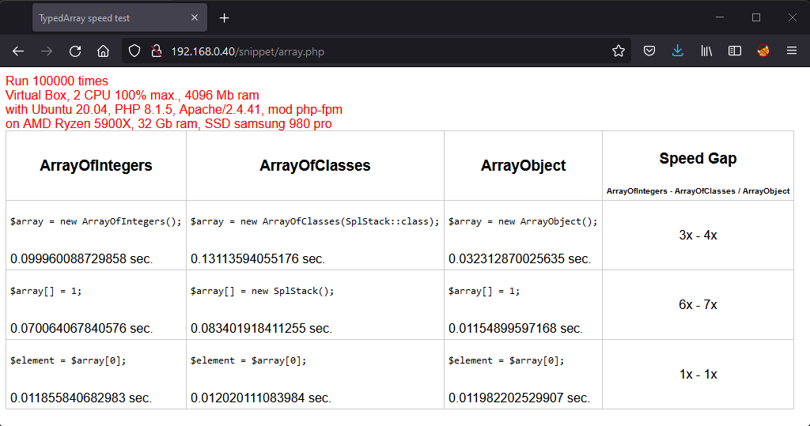
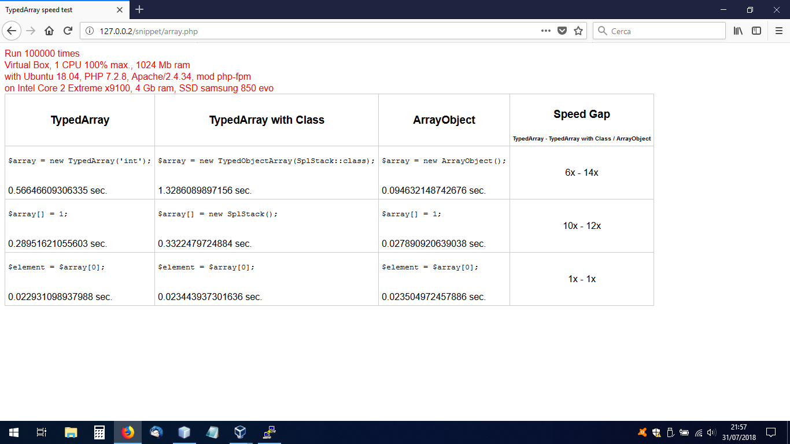

<div align="center">
    <a href="#"></a>
</div>

<br/>

<div align="center">
    <a href="#"></a>
</div>

<br/>

<div align="center">

[](https://github.com/linna/typed-array/actions/workflows/tests.yml)
[](https://scrutinizer-ci.com/g/linna/typed-array/?branch=master)
[](https://scrutinizer-ci.com/g/linna/typed-array/?branch=master)
[](https://styleci.io/repos/93407083)

</div>

## About
This package provide typed arrays for php as extension of native [ArrayObject](http://php.net/manual/en/class.arrayobject.php).  

## Requirements
This package require php 8.0

## Installation
With composer:
```
composer require linna/typed-array
```

## Classes

| Name                  | Native Type Handled | Description                                          |
|-----------------------|---------------------|------------------------------------------------------|
| `ArrayOfArrays`       | array               |                                                      |
| `ArrayOfBooleans`     | bool                |                                                      |
| `ArrayOfCallable`     | callable            |                                                      |
| `ArrayOfClasses`      | any existing class  | passed as first argument in constructor as `::class` |
| `ArrayOfFloats`       | float               |                                                      |
| `ArrayOfIntegers`     | int                 |                                                      |
| `ArrayOfObjects`      | object              |                                                      |
| `ArrayOfStrings`      | string              |                                                      |


## Usage
```php
use Linna\TypedArrayObject\ArrayOfIntegers;
use Linna\TypedArrayObject\ArrayOfClasses;

//correct, only int passed to constructor.
$intArray = new ArrayOfIntegers([1, 2, 3, 4]);

//correct, int assigned
$intArray[] = 5;
//throw InvalidArgumentException, string assigned, int expected.
$intArray[] = 'a';

//correct, int used
$intArray->append(5);
//throw InvalidArgumentException, string used, int expected.
$intArray->append('a');

//throw InvalidArgumentException, mixed array passed to constructor.
$otherIntArray = new ArrayOfIntegers([1, 'a', 3, 4]);

//correct, only Foo class instances passed to constructor.
$fooArray = new ArrayOfClasses(Foo::class, [
    new Foo(),
    new Foo()
]);

//correct, Foo() instance assigned.
$fooArray[] = new Foo();
//throw InvalidArgumentException, Bar() instance assigned.
$fooArray[] = new Bar();

//correct, Foo() instance used.
$fooArray->append(new Foo());
//throw InvalidArgumentException, Bar() instance used, Foo() instance expected.
$fooArray->append(new Bar());

//throw InvalidArgumentException, mixed array of instances passed to constructor.
$otherFooArray = new ArrayOfClasses(Foo::class, [
    new Foo(),
    new Bar()
]);
```

> **Note:** Allowed types are: *array*, *bool*, *callable*, *float*, *int*, *object*, *string* and all existing classes.

## Performance consideration for v3.0
Compared to previous versions of the library, this version is a bit faster because every types has it own class. Do milliseconds really matters?



## Performance consideration for v2.0
Compared to first version of the library, this version is a bit slower because after merging `TypedObjectArray` with `TypedArray`,
there are more code that be executed when new instance is created and on assign operations.



## Performance consideration for v1.0
Compared to the parent class [ArrayObject](http://php.net/manual/en/class.arrayobject.php) typed arrays are slower on writing
approximately from 6x to 8x. The slowness is due to not native `__construct()` and not native `offsetSet()`.  
Other operations do not have a speed difference with the native ArrayObject.
```php
use Linna\TypedArray;

//slower from 6x to 8x.
$array = new TypedArray('int', [1, 2, 3, 4]);
$array[] = 5;

//other operations, fast as native.
//for example:
$arrayElement = $array[0];
$elements = $array->count();
```

View the speed test script on [gist](https://gist.github.com/s3b4stian/9441af5855b795cc1569b3cdb5e7526d).